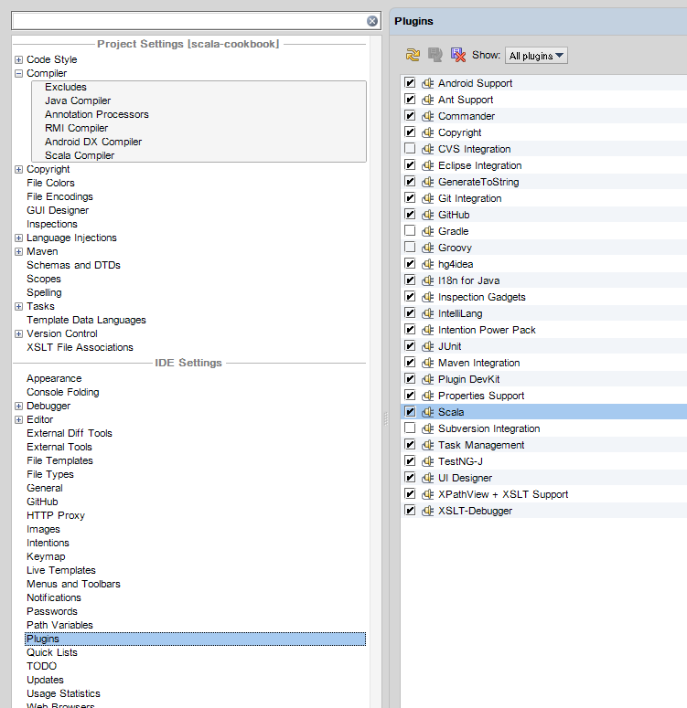
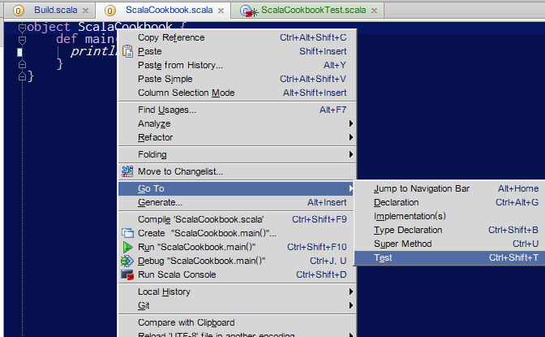
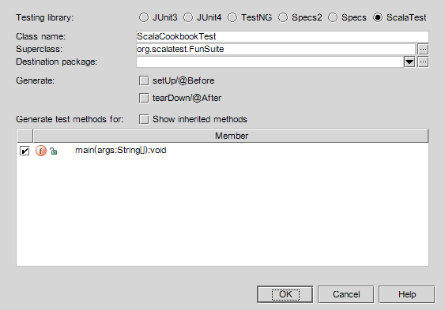
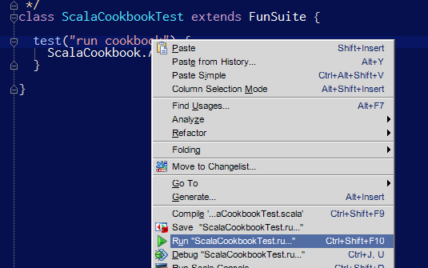




### サンプルコードの取得

Gitの設定

	$ git config --global core.eol lf 
	# Windowsで改行文字がCRLFに変換されるのを防ぐ
	$ git config --global core.autocrlf false

サンプルコードの取得

	$ git clone git://github.com/xerial/scala-cookbook.git 
	$ cd scala-cookbook 
	# lesson0 branchのコードを取り出す
	$ git checkout lesson0
	# scalaコードの実行に必要なライブラリをダウンロードし、
    # target/distにプログラム全体を作成後、$HOME/local以下にインストール
	$ make install
	# scalaコードを実行するスクリプトを起動
	$ ~/local/bin/scala-cookbook
    Hello Scala Cookbook!

* Java 1.6以上が必要。Macでgitをインストールするには、[Mac Ports](http://www.macports.org/)をインストール後、```sudo port install git-core```とする。Windowsで頑張る場合は、[cygwin](http://www.cygwin.com) をインストール（インストール時に、GNU Make, git, sshなどを同時にインストールすること）。コンソールはminttyが良い。

* Windowsユーザーでcygwinを使ったmake installがどうしてもうまく動かない場合。コマンドプロンプトより、```bin\sbt```を起動してもよい。


### IntelliJ IDEAをインストールする

[IntelliJ IDEA](http://www.jetbrains.com/idea/) Community Edition をダウンロード。2012年6月の時点で最強のScala開発環境。ただし、Scalaで開発を始めるにはプラグインのインストールが必要。

* ```File``` -> ```Settings``` -> ```Plugins``` -> ```Scala``` にチェックを入れる



Eclipseを使いたい場合は、[Scala IDE for Eclipse](http://scala-ide.org/)をインストールすると良い。

#### 改行文字の設定
* ```File``` -> ```Settings``` -> ```Code Style``` -> ```General``` -> ```Line separator (for new files)``` でUNIXを選択する。

### IntelliJ のプロジェクトファイルを作成

	# bin/sbt gen-idea を実行
	$ make idea
	
File -> Open Project で、scala-cookbookのフォルダを選択

File -> Project Structure -> Project SDK を確認。赤文字になっている場合、New -> JSDKを選択し、JDKがインストールされているフォルダを選択する。```C:\Program Files\Java\jdk1.7.0``` (Windows), ```/Library/Java/Home``` (MacOS X)など。

#### scala-cookbookの中身
```src/main/scala/ScalaCookbook.scala```

	package xerial.scb 
	
	object ScalaCookbook {
	  def main(args:Array[String]) {
	   println("Hello Scala Cookbook!")
	  }
	}

上記のコードを実行するスクリプトが```$HOME/local/bin/scala-cookbook```としてインストールされる。

main関数の中身を書き換えて、make installを実行すると再コンパイルされる。
	# bin/sbt package-distを実行後、target/dist内の内容を$HOME/local以下にコピー
	$ make install
	$ ~/local/bin/scala-cookbook


### ScalaTestでテストコードを作成する

毎回、make installを実行するのは手間なので、テストコードを作成し、そこからプログラムの挙動を確認する。

* 初期設定: IntelliJで　```Settings``` -> ```Compiler``` -> ```Scala Compiler``` -> ```Project FSC``` -> scala-2.9.2 (version 2.9.2)を選択。FSCはFast Scala Compiler. コンパイル時間を短縮してくれる。

[ScalaTest](http://www.scalatest.org/) を使って新しいテストを作成

テストを作成するフォルダは、```src/test/scala```を選択。プログラム本体とテストコードを分離しておくのが慣習。

Testing libraryではScalaTestを選択する。



#### テストコード例

```src/test/scala/ScalaCookbookTest.scala```

	package xerial.scb
	import org.scalatest.FunSuite
    
    class ScalaCookbookTest extends FunSuite {
      test("run cookbook") {
        ScalaCookbook.main(Array.empty)
      }
    }

### テストコードを実行する

テストしたいコードの上で右クリック -> Run ... を選択



### テストコードを実行しながら開発する

ソースコードを更新 -> コンパイル -> テストコードを実行　というサイクルを繰り返すときに便利。

	# wildcardを用い、特定のテストのみを実行する(test-only)。~は繰り返して実行するときに付ける
    $ bin/sbt "~test-only *ScalaCookbookTest"  
    Using C:\Users\leo\.sbt\0.11.3 as sbt dir, -sbt-dir to override.
    [info] Loading project definition from C:\Users\leo\work\git\scala-cookbook\project
    [info] Set current project to scala-cookbook (in build file:/C:/Users/leo/work/git/scala-cookbook/)
    [info] Compiling 1 Scala source to C:\Users\leo\work\git\scala-cookbook\target\classes...
    [info] Compiling 1 Scala source to C:\Users\leo\work\git\scala-cookbook\target\test-classes...
    Hello Scala Cookbook!
    [info] ScalaCookbookTest:
    [info] - run cookbook
    [info] Passed: : Total 1, Failed 0, Errors 0, Passed 1, Skipped 0
    [success] Total time: 6 s, completed 2012/06/12 11:28:19
    1. Waiting for source changes... (press enter to interrupt)


